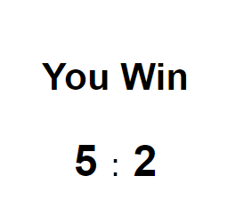
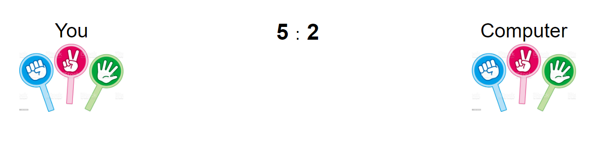
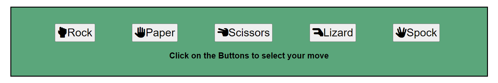

# Rock, Paper, Scissors, Lizard, Spock Game
This website is aimed at anyone that likes a good game of **rock, paper, scissors, lizard, spock**. The aim is to give the sites user a great and submersive experience. The result of the Game is totally fair as the computer chooses randomly. This Game targets towards both **adults** and **children**. The Rules of the Game are defined so the players can easily learn then and play the Game.

# Features
### Existing Features
- Header
     - The Header is located on the top of the page and clearly displays the name of the game. It 
       has a  green background colour which contrasts beautifully with the font. 
     - The bold font of the header attracts the user specially kids to read and remember the name  
       of the game. 
       
         
- Result
     - Whoever gets **5 points** first, either the player or the computer will **Win** the game. 
     - The score will automatically reset to **0**,so the next game can be started.

- Score Board
     - The scores display on the **ScoreBoard**. If the user beats computer 1 score will be added 
       to the user score board featured on **left side**. Same as if computer beats the user the score will be added to the scoreboard on the **right side**.
      

- options
     - In the **Options** section there are **five buttons** with names and icons so the user can choose any of them easily. 
     - The buttons change colours when hover over them.
     - when a user clicks on a button, javaScript **chooses** randomly for computer and 
        **compares** both choices and **announces** the **result** by adding one point to the winner's score Board.
     - Both the **Score** and the **Result** are easy to see and understand who wins the Game. 
      

- Footer
      - The Footer is an **Important** part of the site beacause all the **rules** of the Game are 
        written in here. The user can read and easily understand them.

## Testing
### Bugs
### Validator Testing
### Unfixed Bugs
## Deployment
## Credits
### context
### Media